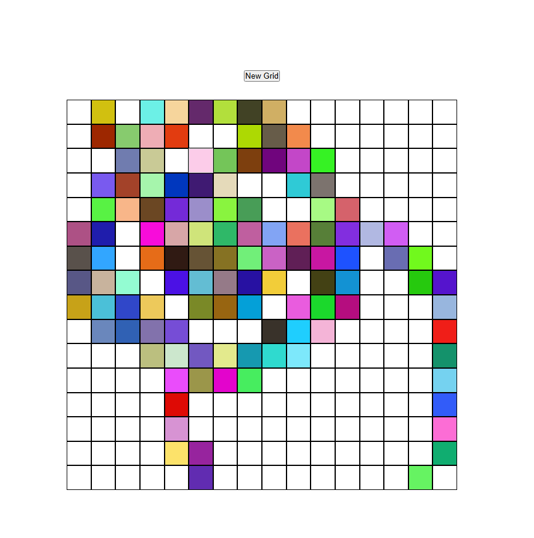

# The Odin Project: Etch a Sketch
---
This project aims to showcase what I have learned about Javascript through the introductory course on [The Odin Project's website](https://www.theodinproject.com/about).

After the Rock Paper Scissors project, I learned more about the DOM and manipulating DOM elements through Javascript. I learned important functions to query elements and then manipulate the elements.

